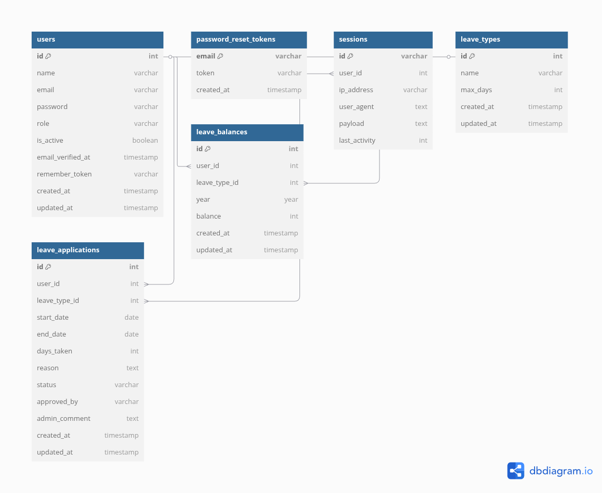

# Employee Leave Management System


## Overview

The **Employee Leave Management System** is a web-based application that streamlines leave management. Both employees and administrators interact through a Filament 3 dashboard, with role-based visibility controlling access to features like leave requests, balance tracking, user management, and reports.

## System Design

The system employs a **modular, layered architecture** with Filament 3 as the primary UI, ensuring scalability and maintainability:

- **Presentation Layer**:
  - **Filament 3 Dashboard**: Single Dashboard UI for employees and admins.
  - Role-based visibility: Employees see leave application,leave balance,leave history and Holidays pages and Admins see user management, leave approvals, holidays, and reports.
  - Dynamic page rendering using Laravel’s role-checking logic (e.g., Filament policies).

- **Application Layer**:
  - Filament resources handle business logic (e.g., leave validation, balance updates, report generation).

- **Data Layer**:
  - SQLite (default) or MySQL (via Docker) with Eloquent ORM for secure, efficient queries.
  - Migrations ensure consistent schema; seeders provide test data.

- **Integration Layer**:
  - Filament Authentication for secure, role-based access control.

- **Scalability**:
  - Database indexing (e.g., `user_id`) and caching for performance.
  - Filament’s optimized rendering for dynamic dashboards.

## Database Design

The database schema, depicted in `er_diagram.png`, ensures efficiency and integrity:

- **Users**:
  - Fields: `id`, `name`, `email`, `password`, `role` (employee/admin), `is_active`.
  - `role` drives Filament visibility; `is_active` controls account access.

- **Leave Requests**:
  - Fields: `id`, `user_id`, `leave_type` (Casual/Earned), `start_date`, `end_date`, `status` (Pending/Approved/Rejected), `reason`.
  - Foreign key `user_id` links to `users`.

- **Leave Balances**:
  - Fields: `id`, `user_id`, `leave_type`, `balance`.
  - Auto-updates on request submission/rejection.

- **Holidays**:
  - Fields: `id`, `date`, `name`.
  - Excludes non-working days from leave calculations.

- **Design Principles**:
  - **Normalization**: 3NF to reduce redundancy.
  - **Constraints**: Foreign keys, unique `email`.
  - **Indexing**: On `user_id` for fast queries.

## Web Application Security

The system prioritizes security, leveraging Filament 3 and Laravel features:

- **Authentication**:
  - Filament Authentication with Bcrypt-hashed passwords.
  - Role-based access control (RBAC) via `role` field, enforced in Filament policies.
  - Employees cannot access admin pages; visibility is dynamically hidden.

- **Data Protection**:
  - HTTPS for secure communication.
  - CSRF tokens (Laravel middleware) prevent cross-site attacks.

- **Database Security**:
  - Eloquent ORM prevents SQL injection with parameterized queries.
  - `.env` files (excluded from Git) store sensitive credentials.

- **Session Management**:
  - Encrypted cookies for secure sessions.
  - Configurable timeouts to prevent unauthorized access.

- **Additional Measures**:
  - Rate limiting on login attempts(5 attempts per minute).
  - Input validation (e.g., leave dates, emails) in Filament forms.
  - Regular Composer updates to patch vulnerabilities.

## Coding Standards

The codebase follows strict standards for maintainability:

- **PHP Standards**:
  - [PSR-12](https://www.php-fig.org/psr/psr-12/) for style (4-space indentation, camelCase).
  - Consistent naming (e.g., `LeaveRequestResource`, `leave_requests`).

- **Laravel/Filament Conventions**:
  - Filament resources (e.g., `UserResource`, `LeaveApplicationResource`) for dashboard pages.
  - Routes in `routes/web.php` with RESTful names (e.g., `leave.request.store`).

- **Code Quality**:
  - Type hints and return types for robustness.
  - Docblocks for classes/methods.

## Key Features

- **User Management**:
  - Employees register; admins activate accounts via Filament Dashboard.
  - Role-based dashboard visibility (employee/admin).

- **Leave Request**:
  - Employees submit Casual/Earned leave requests in Filament.
  - Admins approves or rejects.

- **Leave Balance**:
  - Real-time balance tracking in Filament dashboard.
  - Deducts leave balance when submitting application.
  - Restores leave balance when Rejected.

- **Holidays**:
  - Excludes weekends and holidays, managed in Filament.
  - Ensures accurate leave calculations.

- **Reports**:
  - Employees view their own leave history/summaries in Filament.
  - Admins see all of the employee's history/summaries.

## Technology Stack

- **Backend**: [Laravel 12](https://laravel.com/)
- **UI**: [Filament 3](https://filamentphp.com/) (main dashboard)
- **Authentication**: Filament Authentication
- **Database**: SQLite (default) or MySQL (Docker)
- **Security**: HTTPS, Bcrypt, CSRF/XSS/SQL injection protection

## ER Diagram 📊

See `er_diagram.png` for the database structure.


> **Note**: Ensure `er_diagram.png` is in the project root.

## Installation Guide ⚙️

### Prerequisites

- **PHP**: 8.3.6+
- **Composer**: [Install](https://getcomposer.org/download/)
- **Node.js & npm**: Optional, [Install](https://nodejs.org/)
- **Docker**: Optional for MySQL, [Install](https://www.docker.com/get-started/)
- **Git** Optional

### Setup Steps


1. **Clone the Repository**

   ```bash
   git clone https://github.com/Abungo/leave_management_system.git
   cd leave_management_system
   ```

2. **Install PHP Dependencies**

   ```bash
   composer install
   ```

3. **Install Frontend Dependencies** (Optional)

   ```bash
   npm install
   npm run build
   ```

4. **Configure Environment**

   **SQLite (Default)**:

   ```bash
   cp .env.sqlite .env
   ```

   ```env
   DB_CONNECTION=sqlite
   ```

   ```bash
   touch database/database.sqlite
   ```

   **MySQL (Optional)**:

   ```bash
   cp .env.mysql .env
   ```

   ```env
   DB_CONNECTION=mysql
   DB_HOST=127.0.0.1
   DB_PORT=3306
   DB_DATABASE=leave_management
   DB_USERNAME=laravel
   DB_PASSWORD=secret
   ```

   ```bash
   docker-compose up -d
   ```

5. **Generate Application Key**

   ```bash
   php artisan key:generate
   ```

6. **Run Database Migrations**

   ```bash
   php artisan migrate
   php artisan db:seed
   ```

7. **Start the Development Server**

   ```bash
   php artisan serve
   ```

8. **Access the Dashboard**

   - Visit `http://localhost:8000` for the Filament dashboard.

</details>

### Troubleshooting

- **Permissions**: `chmod -R 775 storage bootstrap/cache`
- **Database Errors**: Check `.env`; for MySQL, verify Docker (`docker-compose ps`).
- **Dependencies**: Re-run `composer install` or `npm install`.

## Usage 🖥️

The Filament 3 dashboard serves as the main interface for both employees and administrators, with role-based visibility controlling access to features.

### For Employees

1. **Register**:
   - Visit `http://localhost:8000`, click **Register**, and submit details (name, email, password).
   - Await admin activation.

2. **Log In**:
   - Access `http://localhost:8000`, enter email/password to view the employee dashboard.

3. **Apply for Leave**:
   - In the Filament dashboard, navigate to **Apply for Leave** (visible to employees as well as admins are admins are also employees and needs to apply for the leave when required).
   - Click **New Leave Application**, select **Casual** or **Earned Leave**, enter start date and end date (both dates inclusive), and submit.
   - System excludes weekends/holidays; balance deducts instantly, restored if rejected.

4. **Track Leave Balance**:
   - View real-time **Casual/Earned** balances in the **Leave Balances** section.

5. **View Reports**:
   - Access **Reports** section for leave history and  summaries.

### For Administrators

1. **Log In**:
   - Visit `http://localhost:8000`, log in with admin credentials to access the full dashboard.

2. **Manage Users**:
   - In **Manage Users** section, view registered employees.
   - Activate accounts by setting `is_active` toggle to off/on.

3. **Manage Leave Requests**:
   - In **Manage Leave Applications**, view pending requests (employee, type, dates).
   - Approve or reject;.

4. **Manage Holidays**:
   - In **Holidays**, add/edit/delete public holidays (e.g., `2025-12-25`, “Christmas”).
   - Ensures accurate leave calculations.

5. **Generate Reports**:
   - In **Reports**:
     - **Employee Leave History**: Detailed records per employee.
     - **Organization-Wide Summary**: Leave usage across employees(Table).

### Notes
- **Role-Based Visibility**: Employees see only leave-related features; admins see all management tools.
- **Holidays**: Keep holiday calendar updated.

## Contributing 🤝

1. Fork the repository.
2. Create a branch (`git checkout -b feature/your-feature`).
3. Commit (`git commit -m "Add feature"`).
4. Push (`git push origin feature/your-feature`).
5. Open a pull request.


## License 📜

Licensed under the [MIT License](./LICENSE).

---

**Built with ❤️ by [Abungo](https://github.com/Abungo)**
